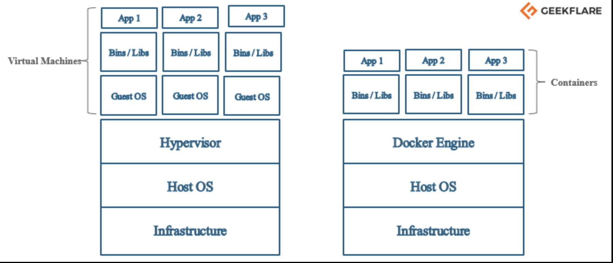

# 00 - Conceptos Básicos de Docker <!-- slide-0 -->


**Fundamentos antes de empezar**

---

## Objetivo <!-- slide-1 -->

Comprender los conceptos fundamentales de Docker antes de empezar a trabajar con contenedores.

---

## ¿Qué aprenderás? <!-- slide-2 -->

- ¿Qué es Docker y para qué sirve?
- Conceptos fundamentales: Imagen, Contenedor, Registry
- Ventajas y casos de uso
- Arquitectura básica de Docker

---

## ¿Qué es Docker? <!-- slide-3 -->

Docker es una plataforma que permite **empaquetar** aplicaciones y sus dependencias en contenedores.

**Analogía:** Si una imagen es una clase, un contenedor es una instancia de esa clase.

---

## Características Principales <!-- slide-4 -->

- **Contenedores**: Entornos aislados y portables
- **Imágenes**: Plantillas para crear contenedores
- **Docker Engine**: Motor que ejecuta los contenedores

**En resumen:** Docker permite ejecutar aplicaciones en cualquier lugar de forma consistente.

---

## Concepto: Imagen <!-- slide-5 -->

### Definición
Plantilla **read-only** para crear contenedores

### Características
- Como un molde o plantilla
- No cambia, es inmutable
- Puede tener múltiples versiones (tags)
- Se almacena en registries (Docker Hub)

**Ejemplo:** `python:3.9`, `nginx:latest`, `postgres:15`

---

## Concepto: Contenedor <!-- slide-6 -->

### Definición
Instancia **ejecutable** de una imagen

### Características
- Como una copia ejecutándose
- Puede iniciarse, detenerse, eliminarse
- Tiene su propio sistema de archivos
- Aislado de otros contenedores

**Ejemplo:** Ejecutar `python:3.9` crea un contenedor con Python

---

## Concepto: Registry <!-- slide-7 -->

### Definición
Repositorio de imágenes

### Ejemplo más común
**Docker Hub** - Registry público y gratuito

### Uso
- Descargar imágenes oficiales
- Compartir tus propias imágenes
- Similar a GitHub pero para imágenes

**URL:** https://hub.docker.com

---

## Concepto: Host <!-- slide-8 -->

### Definición
Tu máquina física donde corre Docker

### Ejemplos
- Tu computadora personal
- Un servidor
- Una máquina virtual en la nube

**Nota:** Docker debe estar instalado en el host

---

## Ventajas de Docker <!-- slide-9 -->

✅ **Aislamiento**: Cada contenedor es independiente  
✅ **Portabilidad**: Funciona igual en cualquier sistema  
✅ **Ligereza**: Más eficiente que máquinas virtuales  
✅ **Rapidez**: Inicio en segundos  

---

## Más Ventajas <!-- slide-10 -->

✅ **Consistencia**: Mismo entorno en desarrollo y producción  
✅ **Escalabilidad**: Fácil de escalar horizontalmente  
✅ **Reproducibilidad**: Mismo resultado siempre  
✅ **Colaboración**: Compartir entornos fácilmente  

---

## Casos de Uso: Desarrollo <!-- slide-11 -->

- Entornos de desarrollo consistentes
- Evitar "funciona en mi máquina"
- Hot-reload y desarrollo local
- Múltiples versiones de la misma herramienta

**Ejemplo:** Un desarrollador usa Node 18, otro Node 20

---

## Casos de Uso: Producción <!-- slide-12 -->

- Despliegues reproducibles
- Escalado automático
- Aislamiento de servicios
- Rollback fácil

**Ejemplo:** Desplegar la misma app en 10 servidores

---

## Casos de Uso: CI/CD <!-- slide-13 -->

- Entornos de prueba aislados
- Builds reproducibles
- Testing automatizado
- Integración continua

**Ejemplo:** Ejecutar tests en cada commit

---

## Arquitectura Básica <!-- slide-14 -->



**Virtual Machines vs Containers**

---

## Flujo de Trabajo Básico <!-- slide-15 -->

1. **Descargar** una imagen (`docker pull nginx`)
2. **Crear** un contenedor (`docker run nginx`)
3. **Ejecutar** la aplicación dentro del contenedor
4. **Detener** cuando termines (`docker stop nginx`)
5. **Eliminar** si ya no lo necesitas (`docker rm nginx`)

---

## Docker vs Máquinas Virtuales <!-- slide-16 -->

| Característica | Docker | Máquinas Virtuales |
|----------------|--------|-------------------|
| **Tamaño** | MBs | GBs |
| **Inicio** | Segundos | Minutos |
| **Recursos** | Compartidos | Aislados |
| **OS** | Comparte kernel | OS completo |

---

## Componentes de Docker <!-- slide-17 -->

### Docker Engine
- Motor que ejecuta contenedores
- Incluye: Docker daemon, API, CLI

### Docker CLI
- Herramienta de línea de comandos
- Comandos: `docker run`, `docker build`, etc.

---

## Más Componentes <!-- slide-18 -->

### Docker Compose
- Orquestación de múltiples contenedores
- Archivo YAML para definir servicios

### Docker Hub
- Registry público de imágenes
- Similar a GitHub pero para imágenes

---

## Comandos Básicos (Referencia) <!-- slide-19 -->

```bash
# Ver información
docker --version
docker info

# Trabajar con imágenes
docker images
docker pull <imagen>
docker rmi <imagen>

# Trabajar con contenedores
docker ps
docker run <imagen>
docker stop <contenedor>
docker rm <contenedor>
```

---

## Resumen de Conceptos <!-- slide-20 -->

- **Imagen**: Plantilla inmutable
- **Contenedor**: Instancia ejecutable
- **Registry**: Repositorio de imágenes
- **Host**: Máquina donde corre Docker
- **Docker Engine**: Motor que ejecuta contenedores

---

## Siguiente Paso <!-- slide-21 -->

Ahora que entiendes los conceptos básicos, puedes empezar con el Módulo 01 para ejecutar tu primer contenedor.

**Módulo 01: Primer Contenedor Sencillo**

---

## Preguntas? <!-- slide-22 -->

¡Tiempo para preguntas antes de empezar!

